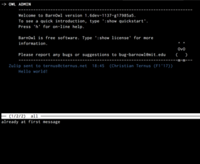

# Easy setup for command-line Zulip with Barnowl

[Adam Glasgall](https://github.com/aglasgall)'s beta [Zulip support for Barnowl](https://github.com/aglasgall/barnowl/tree/zulip/perl/modules/Zulip) is great, but requires compiling Barnowl from source. This isn't the easiest thing in the world, especially if you're on OS X.

Maybe you just want to get a command-line interface to Zulip! That's where this Vagrant setup comes in.

Credit for this most properly goes to [Adam](https://github.com/aglasgall) and [the Zulip team](https://zulipchat.com) — I (ternus) just wrapped and packaged it.

## Prerequisites

1. [Download and install Vagrant](https://www.vagrantup.com/downloads.html).
2. If necessary, download and install a provider such as [Virtualbox](https://www.virtualbox.org/wiki/Downloads).
3. Check out this repository, and in your checkout's directory, run `vagrant up`.
4. Follow the prompts. Make sure to have your Zulip username, realm, and API key on hand.
5. Once the Vagrant VM has started, run `vagrant ssh` and, inside the machine, `./zulip-barnowl`.

That's it! 

## Quick intro to using barnowl

When you start barnowl, you'll see a curses-style interface split into two: an upper window, which shows your incoming/outgoing messages, and a lower window (the *editwin*) which you use to compose messages.

You can scroll through messages with the up/down keys or <kbd>n</kbd>/<kbd>p</kbd>.

To start writing a message, type <kbd>c</kbd> (aliased in the provided configuration to `:zulip:write`). You'll need to either provide the username (~email address) of the person you're writing to, or provide the stream/topic pair with "command-line" arguments, like so:

* `:zulip:write bob@zulipchat.net` — Write a private message to Bob
* `:zulip:write bob@zulipchat.net alice@zulipchat.net` — Write a private group message to Bob and Alice
* `:zulip:write -c general` — Write a stream message to `stream:general`
* `:zulip:write -c general -i foo` — Write a stream message to `stream:general topic:foo`

Typing <kbd>r</kbd> while the cursor (`->`) is on a message will start a reply to that message (the `:zulip:write` line will autofill with the right parameters, and you'll be in the editwin immediately).

Enter your message in the edit window. Press <kbd>Ctrl</kbd>-<kbd>d</kbd> to send, or end with a `.` on a line by itself. <kbd>Ctrl</kbd>-<kbd>c</kbd> will cancel.

The <kbd>:</kbd> key (while not editing a message) starts a command. You can list the commands with `:show commands`. `:help` may provide more useful information.

## Limitations

There's currently no support for:

* Seeing messages earlier in your history
* Receiving zulipgrams while offline (maybe)
* Editing messages
* Sending reactji
* Tab-completion for usernames, or selecting them in some better way
* Edits appearing inline
* Calculating presence cleverly (you'll appear as fully online (green dot) at all times while running barnowl-zulip)
* Many other desirable things

## TODOs

* Better default setup with more aliases
* Automatic color configuration